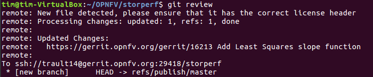
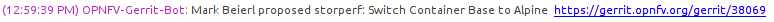
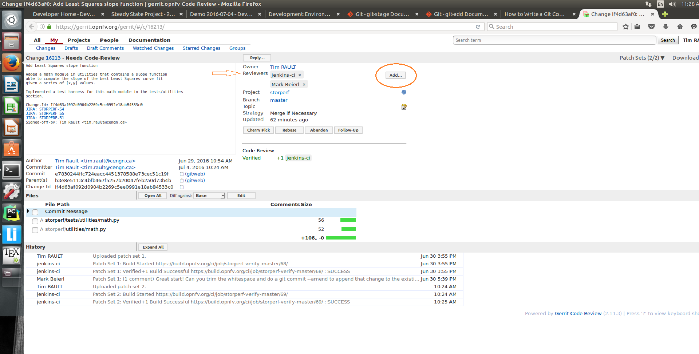
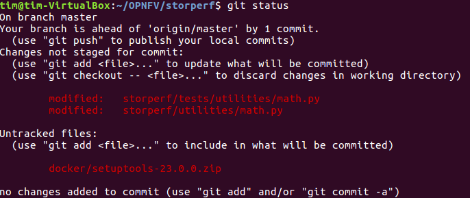
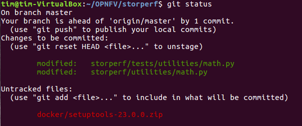
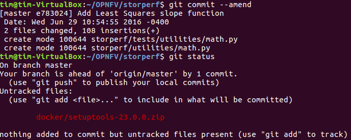
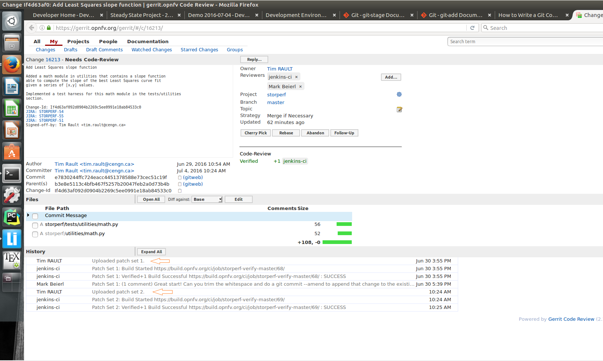
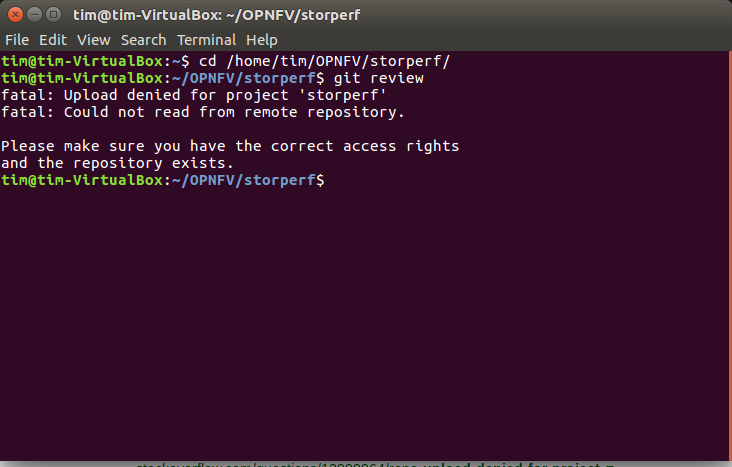
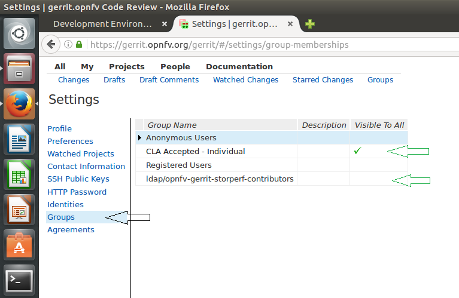

.. This work is licensed under a Creative Commons Attribution 4.0 International License.
.. http://creativecommons.org/licenses/by/4.0
.. (c) OPNFV, Dell EMC and others.

======
Gerrit
======

Installing and configuring Git and Git-Review is necessary in order to follow
this guide. The `Getting Started <https://wiki.opnfv.org/display/DEV/
Developer+Getting+Started>`_ page will provide you with some help for that.

Committing the code with Gerrit
===============================

* Open a terminal window and set the project's directory to the working
  directory using the cd command. In this case "/home/tim/OPNFV/storperf" is the
  path to the StorPerf project folder on my computer. Replace this with the path
  of your own project.

.. code-block:: bash

    cd /home/tim/OPNFV/storperf

* Start a new topic for your change.

.. code-block:: bash

    git checkout -b TOPIC-BRANCH

* Tell Git which files you would like to take into account for the next commit.
  This is called 'staging' the files, by placing them into the staging area,
  using the 'git add' command (or the synonym 'git stage' command).

.. code-block:: bash

    git add storperf/utilities/math.py
    git add storperf/tests/utilities/math.py
    ...

* Alternatively, you can choose to stage all files that have been modified (that
  is the files you have worked on) since the last time you generated a commit,
  by using the -a argument.

.. code-block:: bash

    git add -a

* Git won't let you push (upload) any code to Gerrit if you haven't pulled the
  latest changes first. So the next step is to pull (download) the latest
  changes made to the project by other collaborators using the 'pull' command.

.. code-block:: bash

    git pull

* Now that you have the latest version of the project and you have staged the
  files you wish to push, it is time to actually commit your work to your local
  Git repository.

.. code-block:: bash

    git commit --signoff -m "Title of change

    Test of change that describes in high level what
    was done. There is a lot of documentation in code
    so you do not need to repeat it here.

    JIRA: STORPERF-54"

The message that is required for the commit should follow a specific set of
rules. This practice allows to standardize the description messages attached to
the commits, and eventually navigate among the latter more easily. This
`document <https://chris.beams.io/posts/git-commit/>`_ happened to be very clear
and useful to get started with that.

Pushing the code to Git for review
==================================

* Now that the code has been comitted into your local Git repository the
  following step is to push it online to Gerrit for it to be reviewed. The
  command we will use is 'git review'.

.. code-block:: bash

    git review

* This will automatically push your local commit into Gerrit, and the command
  should get back to you with a Gerrit URL that looks like this :

* The OPNFV-Gerrit-Bot in #opnfv-storperf IRC channel will send a message with
  the URL as well.

* Copy/Paste the URL into a web browser to get to the Gerrit code review you
  have just generated, and click the 'add' button to add reviewers to review
  your changes :

.. note::

    Check out this `section <https://wiki.opnfv.org/display/storperf/Development
    +Environment#DevelopmentEnvironment-IfGerrituploadisdenied>`_ if the git
    review command returns to you with an "access denied" error.

Fetching a Git review
=====================

If you want to collaborate with another developer, you can fetch their review by
the Gerrit change id (which is part of the URL, and listed in the top left as
Change NNNNN).

.. code-block:: bash

    git review -d 16213

would download the patchset for change 16213.  If there were a topic branch
associated with it, it would switch you to that branch, allowing you to look at
different patch sets locally at the same time without conflicts.

Modifying the code under review in Gerrit
=========================================

At the same time the code is being reviewed in Gerrit, you may need to edit it
to make some changes and then send it back for review. The following steps go
through the procedure.

* Once you have modified/edited your code files under your IDE, you will have to
  stage them. The 'status' command is very helpful at this point as it provides
  an overview of Git's current state.

.. code-block:: bash

    git status

* The output of the command provides us with the files that have been modified
  after the latest commit (in this case I modified storperf/tests/utilities/
  math.py and storperf/utilities/math.py).

* We can now stage the files that have been modified as part of the Gerrit code
  review edition/modification/improvement :

.. code-block:: bash

    git add storperf/tests/utilities/math.py
    git add storperf/utilities/math.py

* The 'git status' command should take this into consideration :

* It is now time to commit the newly modified files, but the objective here is
  not to create a new commit, we simply want to inject the new changes into the
  previous commit. We can achieve that with the '--amend' option on the 'commit'
  command :

.. code-block:: bash

    git commit --amend

* If the commit was successful, the 'status' command should not return the updated
  files as about to be committed.

* The final step consists in pushing the newly modified commit to Gerrit.

.. code-block:: bash

    git review

The Gerrit code review should be updated, which results in a 'patch set 2'
notification appearing in the history log. 'patch set 1' being the original code
review proposition.

If Gerrit upload is denied
==========================

The 'git review' command might return to you with an "access denied" error that
looks like this :

In this case, you need to make sure your Gerrit account has been added as a
member of the StorPerf contributors group : ldap/opnfv-gerrit-storperf-
contributors. You also want to check that have signed the CLA (Contributor
License Agreement), if not you can sign it in the "Agreements" section of your
Gerrit account :

