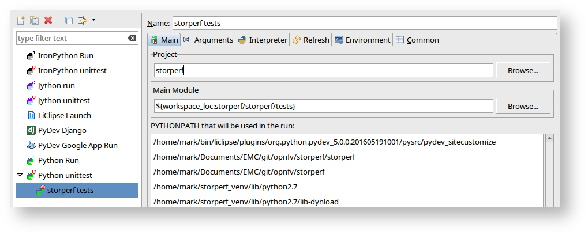
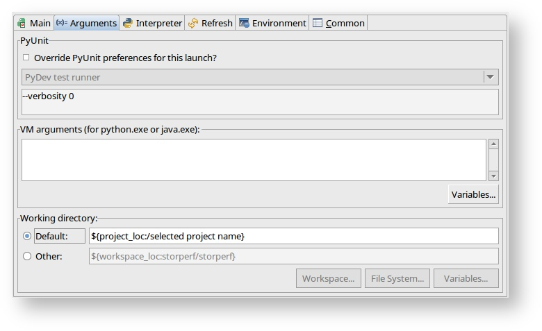
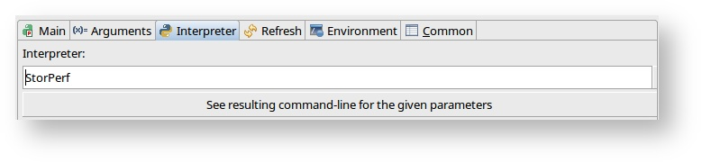
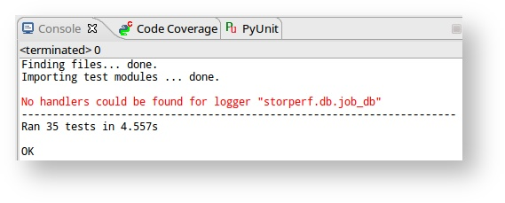
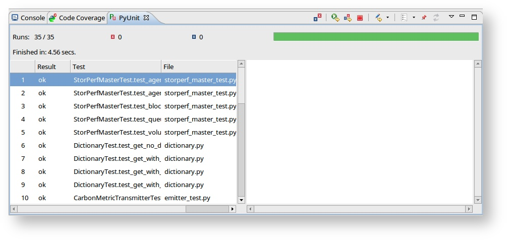
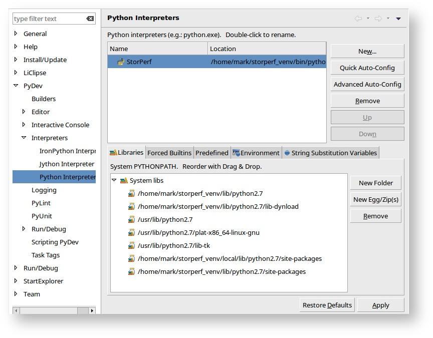
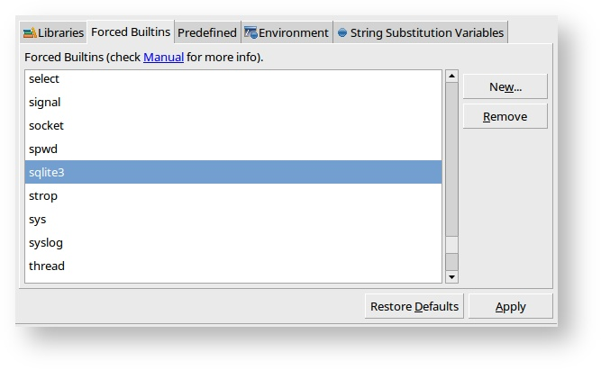

.. This work is licensed under a Creative Commons Attribution 4.0 International License.
.. http://creativecommons.org/licenses/by/4.0
.. (c) OPNFV, Dell EMC and others.

==========
Unit Tests
==========

Running from CLI
================

You technically already did when you ran:

.. code-block:: bash

    ci/verify.sh

The shortcut to running the unit tests again from the command line is:

.. code-block:: bash

    source ~/storperf_venv/bin/activate
    nosetests --with-xunit \
          --with-coverage \
          --cover-package=storperf\
          --cover-xml \
          storperf

.. note::

    You must be in the top level storperf directory in order to run the tests.

Set up under LiClipse
=====================

Running the tests:

Right click on the tests folder and select Run as Python Unit Test. Chances
are, you'll get:

.. code-block:: bash

    Traceback (most recent call last):
      File "/home/mark/Documents/EMC/git/opnfv/storperf/storperf/tests/storperf_master_test.py", line 24, in setUp
        self.storperf = StorPerfMaster()
      File "/home/mark/Documents/EMC/git/opnfv/storperf/storperf/storperf_master.py", line 38, in __init__
        template_file = open("storperf/resources/hot/agent-group.yaml")
    IOError: [Errno 2] No such file or directory: 'storperf/resources/hot/agent-group.yaml'

This means we need to set the working directory of the run configuration.

* Under the menu: Run -> Run Configurations:

* Go to the Arguments tab and change the radio button for Working Directory to
  "Default"

* And on interpreter tab, change the interpreter to StorPerf:

* Click Apply. From now on, the run should be clean:

|

Adding builtins
===============

For some reason, sqlite needs to be added as a builtin.

* Go to Window -> Preferences, PyDev > Interpreters > Python Interpreter and
  select the StorPerf interpreter:

* Go to the Forced Builtins tab, click New and add sqlite3.

