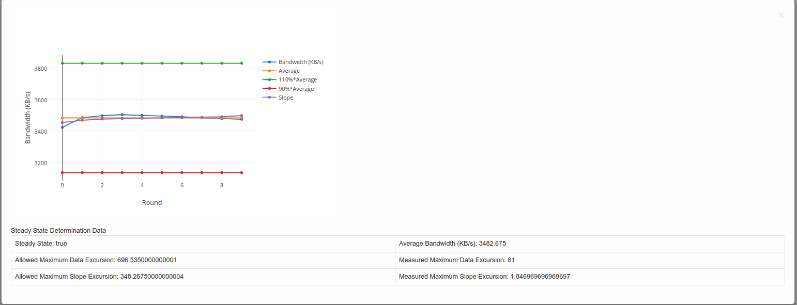
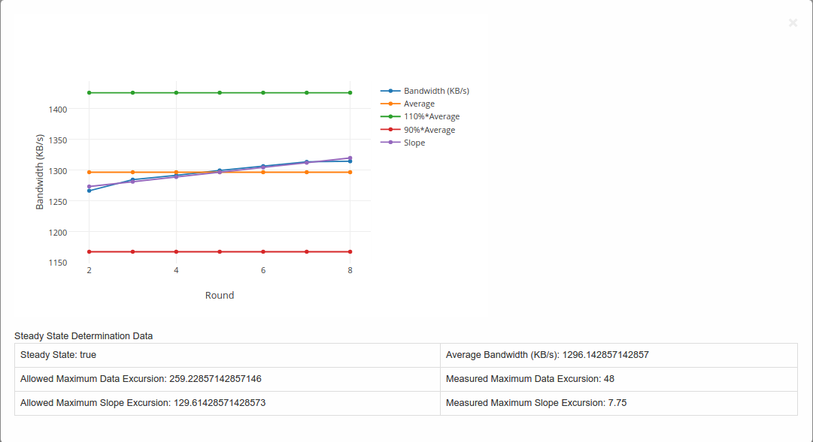

.. This work is licensed under a Creative Commons Attribution 4.0 International License.
.. http://creativecommons.org/licenses/by/4.0
.. (c) OPNFV, Dell EMC and others.

==========================
Storperf Reporting Module
==========================

About this project
=====================

* This project aims to create a series of graphs to support the SNIA reports.
* All data for the reports can be fetched either from the OPNFV Test Results DB, or locally from StorPerf's own database of current run data.
* The report code may be stored in either the Releng repository (so it can be included in the Test Results Dashboards), or locally in StorPerf's own git repository.
* The report (generated by the reporting module) looks like the following example:

Usage
=======

* Enter the URL for the location of the data for which you want to generate the report.
* Note: You can test the module using the testdata present in the directory ``storperf-reporting/src/static/testdata``. Instead of the URL enter the filename present in the testdata directory, eg. **local-data.json**
* After entering the URL, you are taken to the page showing the details of the all the jobs present in the data.
* Click on the *Click here to view details* to see the different block sizes for the respective job.
* Click on the block size and select the parameter for which you want to view the graph.

Graph Explanation
===================

Example of a graph generated is shown below:-

**Steady State Convergence Graph**

* This graph shows the values as reported by StorPerf for the actual and average throughput.
* Also shown is the average +-10% and the slope.
* It serves to visually demonstrate the compliance to the steady state definition.
* The allowed maximum data excursion is 20% of the average (or average x 0.20)
* The allowed maximum slope excursion is 10% of the average.
* The measured data excursion is the value from range.
* The measured slope excursion is the value from range

Workflow
==========

A Flask server is used to fetch the data and is sent to the client side for formation of the graphs (Using Javascript).

Steps involved
--------------

* Step 1: Data is fetched from the OPNFV Test Results ReST API
* Step 2: The fields "report_data" and "metrics" are taken from the JSON object retrieved in the above step and sent to the client side.
* Step 3: The "report_data" is obtained by the client side and a parser written in Javascript along with Plotly.js forms the graphs.

Directory structure
====================

``storperf/docker/storperf-reporting/`` contains the code used for this project.

The file structure is as follows:-

.. code-block:: bash

    storperf-reporting
    |+-- Dockerfile                         # Dockerfile for the storperf-reporting container
    |+-- requirements.txt                   # pip requirements for the container
    +-- src                                 # Contains the code for the flask server
        |+-- app.py                         # Code to run the flask application
        |+-- static                         # Contains the static files (js,css)
        |   |+-- css                        # Contains css files
        |   |   `-- bootstrap.min.css
        |   |+-- images
        |   |+-- js                         # Contains the javascript files
        |   |   |-- bootstrap.min.js
        |   |   |-- Chart.min.js
        |   |   |-- jquery-2.1.3.min.js
        |   |   |-- jquery.bootpag.min.js
        |   |   `-- plotly-latest.min.js    # Used for plotting the graphs
        |   `-- testdata                    # Contains testing data for the module
        `-- templates
            |-- index.html
            |-- plot_jobs.html
            |-- plot_multi_data.html
            `-- plot_tables.html

Graphing libraries and tools
==============================

* Plotly.js is used as the graphing library for this project (Link: https://plot.ly/javascript/)
* Bootstrap is used for the UI of the project.
